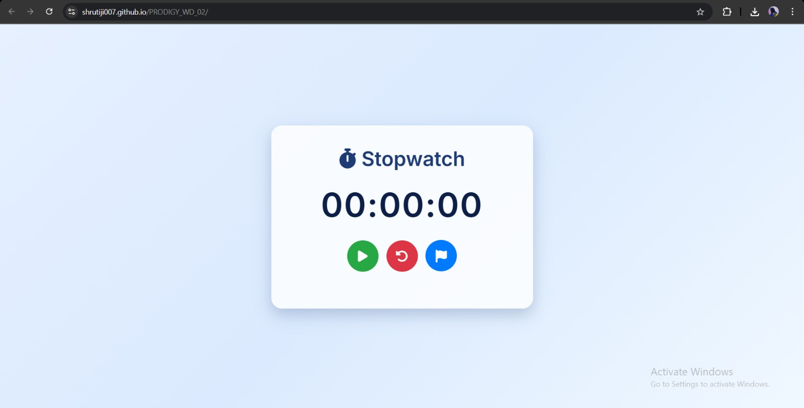
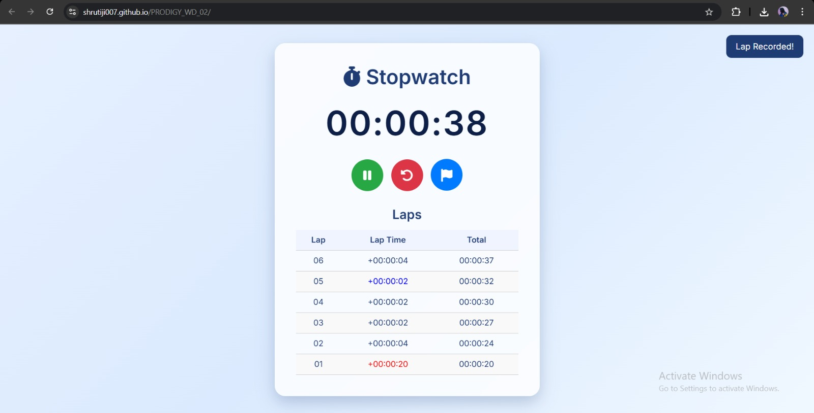

# ⏱️ Stopwatch Web App

A responsive and modern stopwatch web app built with HTML, CSS, and JavaScript. Includes lap tracking, sound effects, toast notifications, animations, and a fresh pastel sky theme. Designed for both desktop and mobile users.

---

## 🚀 Features

- ⏯️ Start / Pause with dynamic icon toggle  
- 🧹 Reset functionality  
- 🏁 Lap tracking with lap time and total time  
- 🔊 Sound effects on start, pause, lap, and reset  
- 🌈 Smooth UI animations and toast confirmation  
- 🎨 Custom themed buttons and visual hierarchy  
- 📱 Fully responsive design

---

## 📸 Screenshots

  

---

## 🙌 Credits

- Icons: [Font Awesome](https://fontawesome.com/)  
- Fonts: [Inter – Google Fonts](https://fonts.google.com/specimen/Inter)

---

## 🛠️ Tech Stack

- HTML5  
- CSS3 (Glassmorphism, Animations, Flexbox)  
- JavaScript (ES6)  

---

## 👩‍💻 Author

Made with ❤️ by [Shruti](https://github.com/Shrutiji007)
